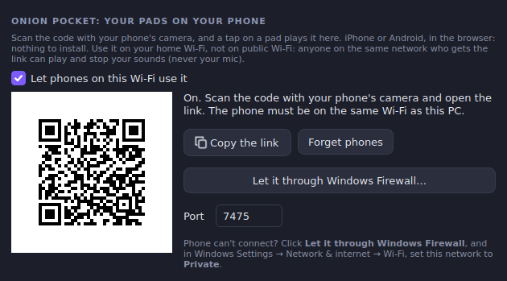
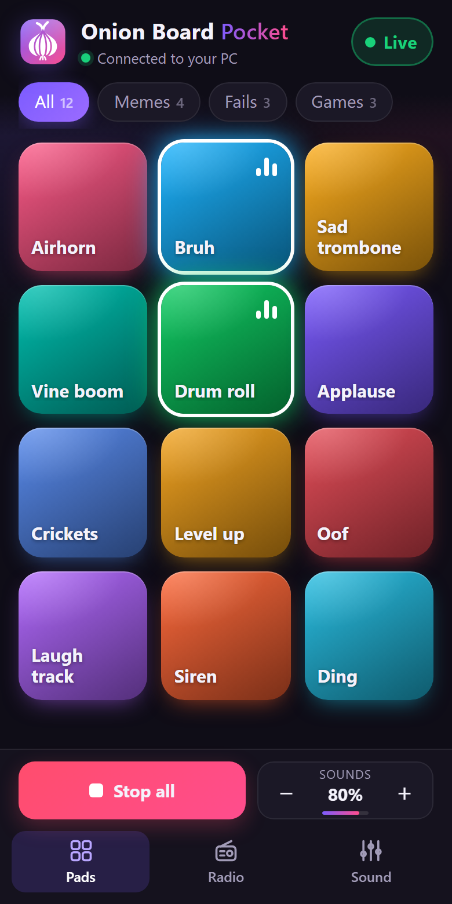
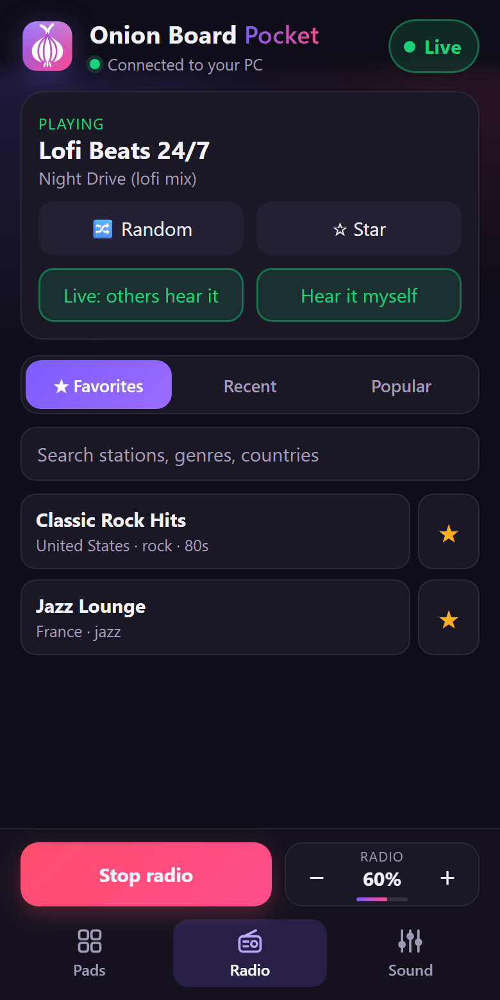
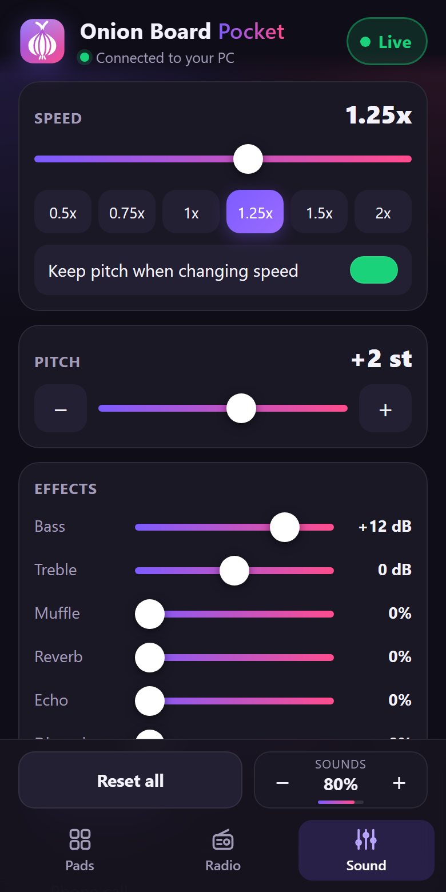

<p align="right"></p>

<p align="center">
  
</p>

<h1 align="center">Onion Pocket</h1>

<p align="center">
  <b>Your pads on your phone.</b> An add-on for
  <a href="https://github.com/Onion-Alien/onion-board">Onion Board</a>.<br>
  Scan a QR code on the PC and tap a pad on your phone: it plays on the PC, into
  Discord or your game like any pad.<br>
  Run the radio and change the speed, pitch, bass and effects from your phone too.<br>
  iPhone or Android, nothing to install on the phone.
</p>

| On the PC: Settings → Remote | On the phone |
|---|---|
|  |  |

| Radio | Sound |
|---|---|
|  |  |

## What your phone can do

- **Pads:** tap to play, by category or search, *Stop all*, the volume, and
  *Live / Muted* (mute you for everyone).
- **Radio:** play and stop the radio, your *Favorites*, *Recent* and *Popular*
  stations or a search, a random station, star a station, *Live* (others hear the
  radio) or *Only me*, *Hear it myself*, and the radio's volume.
- **Sound:** the live speed (with the 0.5x–2x quick speeds) and pitch, *Keep pitch*,
  bass, treble, muffle, reverb, echo and distortion, the presets (*Bass boosted*,
  *Underwater*, *Phone call*…), *Reset all*, and *Who's listening* (Discord, Steam
  voice, Vivox…).

Whatever the phone changes moves on the PC too: the same sliders and buttons. The
Radio and Sound tabs need Onion Board 1.7.2 or newer; with an older one the phone
shows the pads.

## How it works

While it's on, Onion Board runs a tiny web server on your PC that only answers on
your home network. The QR code is just that server's address with the phone's key:
`http://<your PC>:7475/#k=…`. The phone's camera opens it like any link, the page
comes from your PC, and a tap sends "play this sound" back to it. The phone itself
never plays anything: phones don't let one app put sound into another app's mic,
so the PC still does the playing ([docs/PHONE.md](docs/PHONE.md) has the research).

- **Off by default.** Settings → Remote → *Let phones on this Wi-Fi use it*.
- **Only your network.** It answers only addresses on your local network, and only
  with its own key (in the QR code; separate from the Stream Deck key). *Forget
  phones* makes a new key. An address that gets the key wrong 5 times is ignored
  for a minute.
- **Never your mic.** A phone can play your pads, run the radio and change the live
  speed, pitch and effects (the list above). Never the mic, the voice changer, the
  instant replay, or anything that reads or saves files.
- **Plain HTTP on your Wi-Fi.** Someone on the same network who can read its
  traffic could take the key and play your sounds. Use it at home, not on public
  Wi-Fi. [SECURITY.md](SECURITY.md) has the details.
- **Phone can't connect?** When you tick *Let phones on this Wi-Fi use it*, Windows
  asks once (its admin prompt) to let phones through the firewall: say yes. Said no?
  Click *Let it through Windows Firewall*. And in Windows Settings → Network &
  internet → Wi-Fi, set your network to *Private*.

## Install

In Onion Board (newer than 1.6.8): **Settings → Remote → *Get Onion Pocket***. It
downloads this project's latest release from GitHub, checks it against the SHA-256
GitHub lists for it, and installs it; its card then takes that button's place. If it
can't be downloaded, the button just goes away and Onion Board carries on as before.

To try a build of your own instead: `python scripts/build_module.py` →
`dist/OnionPocket-module.zip`, then either start Onion Board with
`ONIONBOARD_ONION_POCKET_ZIP` set to that zip and click *Get Onion Pocket*, or unzip it
into `%APPDATA%\OnionBoard\modules\` and restart Onion Board.

To remove it, delete `%APPDATA%\OnionBoard\modules\onion-pocket`.

## Releasing

Raise `__version__` in `onion_pocket/__init__.py`, update `docs/RELEASE-NOTES.md`,
and push a matching tag (`v0.1.0`). `.github/workflows/release.yml` runs the checks,
builds the zip and publishes the release Onion Board downloads from.

## Code

| file | what it does |
|---|---|
| `onion_pocket/addon.py` | `create(host)`: the add-on, starting and stopping its server, and its card on Settings → Remote |
| `onion_pocket/host.py` | what Onion Board looks like from here: the whole contract (`API_VERSION`) |
| `onion_pocket/lan.py` | this PC's address on the home network, the pairing link, the Windows Firewall rule |
| `onion_pocket/page.py` | the phone page: one HTML file, inline style and script, a hash-only Content-Security-Policy |
| `onion_pocket/qr.py` | QR codes drawn in code (byte mode, level M, versions 1–10) |
| `scripts/build_module.py` | the add-on zip Onion Board installs; refuses imports Onion Board doesn't ship |
| `scripts/check_sensitive.py` | secrets / personal-data scan, also the pre-commit hook |
| `tests/` | offscreen tests against a stand-in host (`tests/fakehost.py`) |
| `docs/PHONE.md` | the research (what phones can and can't do) and the design |
| `scripts/demo_page.py` | the phone page in your browser with made-up sounds, no Onion Board needed; `--shot` remakes `docs/screenshots/phone.png` |
| `.github/workflows/checks.yml` | on every push: the secrets / personal-data scan over the whole history, gitleaks, ruff and the tests |
| `.github/workflows/release.yml` | on a `v*` tag: the checks, then the add-on zip published as a GitHub release |

## Developing

```
python -m venv .venv
.venv\Scripts\pip install -r requirements-dev.txt
.venv\Scripts\ruff check .
.venv\Scripts\python -m pytest
git config core.hooksPath .githooks
```

To work on the phone page's look: `.venv\Scripts\python scripts\demo_page.py` and open
the link it prints, in your browser's phone view (F12, device toolbar). Nothing
plays; it's the real page with a pretend board behind it.

The add-on runs inside Onion Board, which has no pip: it may only import the
standard library and PySide6 (`scripts/build_module.py` checks).

## License

Same as Onion Board: [LICENSE](LICENSE).
